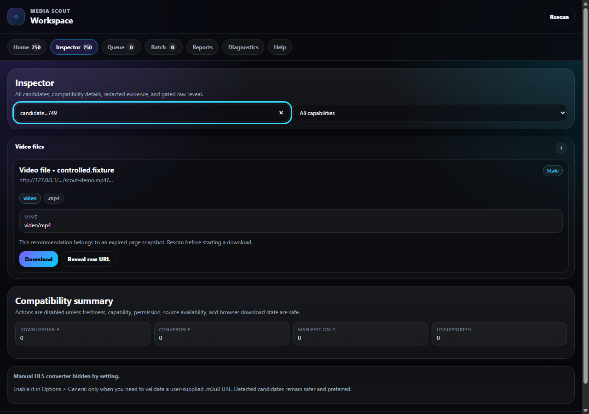
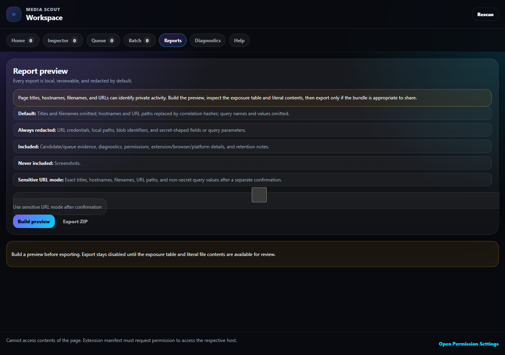
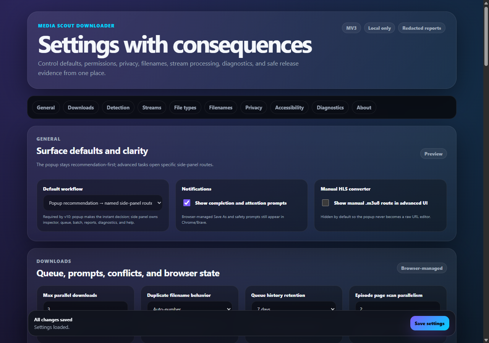

# Media Scout Downloader

[](https://github.com/NouraldinFarge/media-scout-downloader/actions/workflows/ci.yml)
[](https://github.com/NouraldinFarge/media-scout-downloader/actions/workflows/browser-e2e.yml)
[](https://github.com/NouraldinFarge/media-scout-downloader/actions/workflows/codeql.yml)

Media Scout Downloader is a local-first Chrome Manifest V3 extension for finding and downloading media that the active page has already exposed to the browser. It favors a clear recommendation in the popup, keeps advanced evidence in a named side-panel workspace, and fails closed when a path would require bypassing access controls.

> **Repository status:** The `3.7.13` source is public for review under the MIT License. It remains an unreleased prerelease: there is no Chrome Web Store listing or supported public binary, and the manual Chrome/Brave, assistive-technology, artifact, and release-approval gates in [`TEST_PLAN.md`](TEST_PLAN.md) remain open.

## Product tour

These product states were captured from the real unpacked `3.7.13` extension in a disposable Playwright Chromium profile. They use only controlled loopback fixtures and generated state; no browsing history, account data, private URLs, or user media appears in them. Capture details and asset checks are recorded in [`docs/media/README.md`](docs/media/README.md).

### Bounded inspector

[](docs/media/inspector-route.png)

The inspector separates eligible media from rejected or unsupported candidates and keeps its evidence inside a bounded, readable workspace. [Open the full-size inspector capture.](docs/media/inspector-route.png)

### Redacted report preview

[](docs/media/report-route.png)

The export preview explains default redaction, always-redacted fields, and the user's final review responsibility before a report leaves the device. [Open the full-size report capture.](docs/media/report-route.png)

### Permission-aware settings

[](docs/media/settings-overview.png)

Settings make local-first behavior, advanced discovery, file access, and per-site permissions visible without implying that optional access is automatic. [Open the full-size settings capture.](docs/media/settings-overview.png)

## Verified engineering evidence

| Evidence | Current result | Scope and boundary |
| --- | --- | --- |
| Regression gate | 9 self-test suites plus repository assertions | Exercises validators, policy decisions, settings normalization, report privacy, download strategy selection, queue behavior, and ZIP safety. |
| Targeted coverage | 91.74% statements/lines, 72.51% branches, 90.97% functions | Applies only to `validators.js`, `report-privacy.js`, `download-allow-list.js`, and `report-manager.js`; it is **not** whole-extension coverage. |
| Controlled fixture server | 16 endpoints and 11 generated-file hashes | Covers direct media, HLS/DASH, empty/slow/auth/expired/CORS cases, and deterministic local fixtures without third-party media. |
| Browser smoke | Real unpacked extension; zero serious/critical axe findings in the tested routes | Uses a disposable Playwright Chromium profile and controlled synthetic state. Manual Chrome/Brave and assistive-technology gates remain open. |
| Performance gate | 7 repeatable Node benchmarks within explicit budgets | Measures bounded parsing, storage, grouping, reports, restart hydration, and ZIP assembly; it is not production telemetry. |
| Staging build | 40 allowlisted files and zero runtime dependencies | CI retains an unsigned verification-only candidate briefly; it is not a supported public binary or release. |

## What it does

- Scans visible `<video>`, `<audio>`, source, track, poster, metadata, selected page literals, and recent Resource Timing entries.
- Detects progressive video/audio, HLS playlists, DASH manifests, subtitles, artwork, and selected supporting formats.
- Downloads supported direct files through Chrome's download API.
- Handles bounded, unencrypted MPEG-TS HLS with Smart MP4, MP4 remux, timestamp-fixed TS, raw TS concatenation, playlist-only, or an external-helper note.
- Keeps a queue with pause, resume, cancel, retry, progress, and privacy-reduced restart history.
- Generates local diagnostic ZIP reports with a field-by-field exposure summary, literal text-file preview, stale-input invalidation, and redaction controls.
- Offers optional per-site or all-site network detection while retaining basic active-tab scanning.

It does not decrypt DRM, defeat encryption, bypass authentication or paywalls, reuse protected stream components, evade CORS, or scrape hidden episode numbers.

## Install for development

Requirements: Chrome 114 or newer and Node.js 22 or newer.

1. Open `chrome://extensions`.
2. Enable Developer mode.
3. Choose **Load unpacked** and select this repository root.
4. Pin Media Scout Downloader.
5. Open a page you are authorized to download from, start playback if needed, then open the extension.

The popup gives the next recommended action. The side panel contains Home, Inspector, Queue, Batch Preview, Reports, Diagnostics, and Help. Settings controls website access, file types, filenames, queue retention, HLS behavior, privacy, and diagnostics.

## Permission model

| Permission | Why it is needed |
| --- | --- |
| `activeTab` | Run a user-initiated basic scan on the current tab. |
| `scripting` | Inject the local scanner after an explicit extension action. |
| `downloads` | Start and reconcile browser-managed downloads. |
| `storage` | Store settings, counters, and privacy-reduced queue history locally. |
| `webRequest` | Observe media-shaped requests only on sites for which host access is granted. |
| `sidePanel` | Provide the advanced workspace. |
| `notifications` | Show enabled completion or attention prompts. |
| Optional HTTP(S) hosts | Enable network detection only after the user grants website access. |

The extension does not request cookies, browsing history, request blocking, debugger access, or a broad mandatory host permission. All executable code ships in the package; there are no remote scripts or runtime dependencies.

## Supported and limited paths

| Candidate | Built-in behavior |
| --- | --- |
| Progressive HTTP(S) media | Direct browser download when evidence and current settings allow it. |
| Page-local `blob:` media | Page-context handoff while the source tab remains available. |
| Unencrypted MPEG-TS HLS VOD | Experimental, memory-bound merge/remux after playlist inspection; 24 MiB per segment, 128 MiB aggregate, and earlier estimate rejection. |
| HLS master playlist | Select a visible self-contained variant according to settings. |
| DASH | Save the MPD manifest only; no built-in segment assembly. |
| fMP4/CMAF, separate-audio, low-latency, or live HLS | Playlist-only or explicit unsupported state unless a safe self-contained fallback is visible. |
| Encrypted, DRM, authenticated, paywalled, CORS-blocked, or stale evidence | No bypass; explain the limitation and require fresh authorized evidence. |

The decision rules are documented in [`DOWNLOAD_ALLOW_LIST.md`](DOWNLOAD_ALLOW_LIST.md).

## Architecture

```text
manifest.json
assets/icons/                 packaged extension icons
src/background/               service worker, detection, policy, queue, reports
src/content/                  bounded page scanner and page-context HLS/blob work
src/popup/                    recommendation-first action popup
src/sidepanel/                advanced workspace routes
src/options/                  settings, permissions, privacy, and diagnostics
src/shared/                   constants, validation, policy models, and utilities
test-harness/                 dependency-free checks, tests, and staging build
```

The background service worker owns privileged actions. Content scripts may submit only bounded scan evidence and progress messages. Extension pages send privileged commands through a validated message boundary. Raw task URLs remain runtime-only where practical; persisted queue history contains reduced identifiers, categories, progress, and timestamps.

Hard safety ceilings keep hostile or accidental page structures bounded: 750 retained candidates per tab, 500 candidates per normal scan, 4 MiB playlist inspection, 200 HLS variants, 100 audio renditions, 6,000 HLS segments, 500 DASH representation details, 4,096-character retained media URLs, 24 MiB per HLS segment, and 128 MiB aggregate HLS bytes. Items are prioritized so manifests and primary media survive ahead of artwork and low-value fragments.

## Development and validation

The shipped extension has zero runtime dependencies. Development tools are pinned in `package-lock.json`; install them with a locked `npm ci`.

```sh
npm run format
npm run check
npm run build
```

`npm run format` normalizes text-file line endings, trailing whitespace, and final newlines. `npm run check` runs formatting checks, repository lint rules, JavaScript syntax checks, self-tests, manifest/CSP/permission assertions, message and URL validation, settings normalization, download-policy tests, strategy ordering, helper-command escaping, report redaction, and report-ZIP safety checks.

`npm run build` creates `dist/media-scout-downloader/` with only the packaged manifest, source, and assets. `dist/` and generated archives are ignored.

Manual browser coverage remains mandatory because Chrome extension APIs, browser prompts, responsive side-panel layouts, accessibility APIs, and media fixtures cannot be fully represented by the Node gate. Follow [`TEST_PLAN.md`](TEST_PLAN.md) and [`TESTING.md`](TESTING.md).

The public source tree is backed by green GitHub CI and CodeQL runs, plus an exact-artifact Playwright Chromium smoke run on the merged pull request. Those automated checks are engineering evidence, not a claim of Chrome Web Store approval, broad browser compatibility, accessibility conformance, or release readiness.

## Privacy and security

Media Scout has no analytics, ads, telemetry service, cloud account, or remote configuration channel. Reports are generated only on request and exclude raw URLs and query-parameter names by default. Site access can be revoked from Settings.

See [`PRIVACY.md`](PRIVACY.md), [`SECURITY.md`](SECURITY.md), and [`CHANGELOG.md`](CHANGELOG.md). Use the extension only for content you own or are authorized to save.

## License

Media Scout Downloader is licensed under the [MIT License](LICENSE.md). The software license does not grant rights to media, websites, services, or other third-party content; use remains limited to content you own or are authorized to save.
