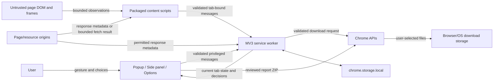

# Threat model and data-flow inventory

Scope: Media Scout Downloader `3.7.13` public-source prerelease candidate

Review date: 2026-08-17

Security posture: local-first, Manifest V3, no developer backend, no analytics, no remote configuration, and no runtime package dependencies at this P0 checkpoint.

This is an engineering threat model, not a guarantee that the product is secure or legally compliant. Browser-matrix, accessibility, performance, and remote CI evidence are tracked separately.

## Assets and security objectives

| Asset | Objective |
| --- | --- |
| Page/tab context | Do not attribute one document's title, URL, frames, or candidates to a later document. |
| Media/resource URLs | Keep runtime use scoped to the user-visible feature; avoid unintended persistence, logging, or report disclosure. |
| Credentials and access controls | Never request cookies/history, expose URL credentials, reuse signed/expiring components, or implement DRM/auth/paywall/CORS bypasses. |
| Download intent | Start only the action the user selected from current, supported evidence; avoid duplicate or post-cancel handoffs. |
| Local settings/history | Validate shape, bound retention, prevent delayed writes from restoring cleared data, and delete only the named scope. |
| Extension privileges | Accept privileged commands only from this extension's pages; accept content-script messages only from a real tab owned by this extension. |
| Report contents | Show the exact text and field exposure before export, minimize defaults, and block stale or mutated preview exports. |
| Host page integrity | Treat the DOM as untrusted input and avoid injecting overlays, unsafe HTML, or remote code. |
| CPU/memory/browser stability | Bound DOM, URL, frame, manifest, segment, candidate, queue, report, and download work. |

## Components and trust boundaries

Trust boundaries:

1. **Page to isolated content script.** DOM attributes, text, script text, media metadata, frame data, Resource Timing entries, playlist text, and fetch errors are attacker-controlled. They are clipped, normalized, prioritized, and bounded before messaging.
2. **Content script to service worker.** The service worker verifies the sender extension ID, requires a real non-extension tab, validates message type/shape/length/counts, and binds accepted items to the sender/source tab and current tab revision.
3. **Extension UI to service worker.** Only extension-origin popup, side-panel, options, or extension-tab senders can invoke privileged message types. Every message passes a type-specific validator.
4. **Service worker to Chrome APIs.** Tab injection, permissions, downloads, web-request observations, storage, notifications, and side-panel operations remain subject to Chrome's permission model and browser prompts.
5. **Extension to network origin.** Optional HTTP(S) host access gates network observation. Service-worker manifest inspection omits credentials. Page-context fetches use normal page/CORS/auth rules and are never treated as authority to bypass a failure.
6. **Extension to local storage.** Runtime URLs/titles/filenames stay in memory. Only validated settings, bounded diagnostics, count summaries, and privacy-reduced queue metadata are persisted.
7. **Preview to exported filesystem.** Report files cross from extension memory into a user-controlled ZIP. The user sees the exposure matrix and literal file content first; ZIP entries are normalized once and the exact array is digested and revalidated immediately before export.
8. **External-helper note to another process.** The extension only saves explanatory text. Any command is inert until the user copies it into a shell; quoting is generated per supported shell, and this path is never represented as built-in conversion.

## Data-flow inventory

| Flow | Data | Trigger/scope | Retention | Transfer |
| --- | --- | --- | --- | --- |
| Active-tab state | Tab ID, title, URL, candidates, page/frame evidence | User opens/refreshes the UI; current active or explicitly handed-off source tab | In-memory until navigation, close, clear, or worker lifecycle | Extension contexts only |
| DOM scan | Media/source/track/poster/metadata attributes, selected page literals, media element state, frame URL/title, Resource Timing summaries | Packaged scanner on active or permitted page | Bounded in-memory candidate state | Content script to service worker |
| Web-request observation | Resource URL/type, selected response headers, completion event | Only tabs placed in the detector's scoped set; Chrome host access applies | Bounded in-memory candidate state | Chrome API to service worker |
| Manifest probe | Bounded HLS/DASH text and derived structure | User-visible scan/report/download decision; at most configured structural limits | Derived in-memory evidence; no raw manifest persistence | Resource origin to page/service worker under normal browser rules |
| Download | Media URL, filename, method, progress/result | Explicit allowed action from current evidence | Runtime task detail in memory; reduced queue metadata up to 0–30 days | Chrome download API and selected resource origin |
| Settings | File types, bounded concurrency/retention, HLS behavior, filename template/folder, report/debug toggles | User saves Options | Until changed, extension data cleared, or uninstall | `chrome.storage.local` only |
| Diagnostics | Strategy counters, error categories, generic timestamps | Local outcomes | Until reset/extension removal | `chrome.storage.local` only |
| Queue history | Task IDs/codes, status, bounded numeric progress/results, error category/code | Queue changes when retention > 0 | Configured 0–30 days; default 7; explicit/lower-retention clear serialized | `chrome.storage.local` only |
| Side-panel launch intent | Route, source tab ID, timestamp | Popup asks Chrome to open a side-panel route | One-shot session value, consumed immediately | `chrome.storage.session` only |
| Warning/debug logs | Redacted messages/objects | Warnings; debug only after opt-in | Browser-controlled developer console lifecycle | Local browser console only |
| Report preview | Generated text files, exposure metadata, context signatures, digest | User requests report; sensitive mode needs saved opt-in plus confirmation | Open extension-page memory; invalidated on input change | Extension UI only |
| Report ZIP | Exact normalized preview files | Explicit export after current validation | Extension retains no copy; browser/OS/user controls file | Chrome downloads to local filesystem |
| Notification | Generic completion/failure status | If enabled | Browser-controlled transient UI | Chrome notification API |

## Threats, controls, and residual risk

| Threat | Primary controls | Residual risk/status |
| --- | --- | --- |
| DOM/URL injection into extension UI | No `innerHTML`, `outerHTML`, `insertAdjacentHTML`, `document.write`, `eval`, or `new Function`; DOM builders use `textContent`; URL schemes validated. | Browser/UI regression testing still required. |
| Page forges privileged command | Sender class is checked in the service worker; content-script and extension-page message types are separated; bounded validators run before dispatch. | A compromised extension page would already have extension origin privileges; CSP and packaged-only code reduce that risk. |
| Cross-tab or stale-document confusion | Tab IDs, stored tab info, per-tab revisions, navigation/closure clearing, post-await revision checks, fresh download allow-list decisions, and report context validation. | Same-document pages can change rapidly; the export path reruns a stable scan projection and blocks mismatches. |
| Permission escalation or spoofed origin | Host permissions remain optional; current-site request must exactly match the active tab's origin pattern; requests originate in visible user gestures; denied/revoked states return explicit UI outcomes. | Managed-browser policy behavior needs matrix testing. |
| Unsafe URL or protected media path | Only HTTP(S)/controlled blob paths accepted; signed/expiring, DRM, encrypted, authentication, paywall, CORS, and unsupported layouts fail closed; DASH remains manifest-only. | Heuristics cannot prove rights or detect every protection system; user authorization remains required. |
| Cookie/credential exposure | No cookie/history permissions; service-worker manifest fetch uses `credentials: 'omit'`; reports/logs remove URL credentials and secret-shaped values. | Same-origin page fetch can use the page's normal browser session because that is the existing page context; it does not bypass access control. |
| Persistent browsing-history leak | Persisted diagnostics/queue schemas omit URLs, titles, hostnames, filenames, raw text, and output names; prototype-collision keys are rejected; retention/clear writes are serialized. | `chrome.storage.local` is browser-managed, not application-layer encrypted; persisted content is intentionally minimized instead. |
| Report misrepresentation/exfiltration | Default minimization, explicit exposure manifest, literal safe preview, sensitive-mode double opt-in, no screenshots, context/digest/token checks, exact ZIP equality tests, normalized paths, and explicit retention copy. | Sensitive mode remains identifying by design and must not be described as anonymous. Correlation values are not cryptographic anonymization. |
| ZIP traversal/duplicate-name confusion | Remove empty/dot/dot-dot segments and control characters, cap path length/count, de-duplicate case-insensitively before preview and ZIP creation. | The browser/OS still owns the selected download location and post-download handling. |
| Download cancellation/duplicate race | Queue terminal states are monotonic, late progress rejected, canceled worker results ignored, browser handoff ambiguity fails without retry, watchdog cancels known download IDs. | Browser UI and platform-specific failure modes require real-browser tests. |
| Shell injection through helper notes | Shell-specific escaping and regression fixtures; helper notes are explicitly external and inert until copied. | Users can edit/run commands; helper integration is outside the extension security boundary. |
| Remote-code or supply-chain execution | Manifest V3 CSP is self-only with `object-src 'none'`; no remote module imports/dynamic code paths; no runtime dependencies at P0. | Development dependencies added later require lockfile, audit, SBOM, and CI review. |
| Resource exhaustion from hostile pages/manifests | Explicit caps for visits, strings, URLs, frames, candidates, response bytes, variants, renditions, representations, segments, per-segment bytes, aggregate merge bytes, concurrency, queue history, and report lists. | Blob-based HLS merge can still create high peak memory below the 768 MiB cap; P1 lower-memory evidence is required. |
| Sensitive console output | Shared logger redacts embedded URLs, query data, local paths, filename-like text, credentials, and secret-shaped object fields before warning/debug output. | Chrome/third-party errors may contain novel identifier formats; debug remains opt-in and no log should be shared without review. |

## Current verification hooks

- `test-harness/static-checks.mjs` rejects dangerous dynamic code/HTML assignment, remote imports, high-risk permissions, broken local imports, and manifest/CSP drift.
- `test-harness/run-tests.mjs` exercises message/URL/settings validation, protection decisions, stale scans, queue cancellation/persistence races, browser handoff ambiguity, report redaction/invalidation/equality, ZIP traversal, bounds, log redaction, and permission/CSP assertions.
- `TEST_PLAN.md` defines the remaining controlled-fixture browser, permission, accessibility, report, resilience, and release checks.

## Official policy references checked

- [Chrome Web Store Program Policies](https://developer.chrome.com/docs/webstore/program-policies/policies)
- [Chrome Web Store Limited Use policy](https://developer.chrome.com/docs/webstore/program-policies/limited-use/)
- [Chrome Web Store user-data FAQ](https://developer.chrome.com/docs/webstore/program-policies/user-data-faq/)
- [Chrome extension permission declarations](https://developer.chrome.com/docs/extensions/develop/concepts/declare-permissions)
- [Optional permissions API](https://developer.chrome.com/docs/extensions/reference/api/permissions)
- [Manifest V3 remote-code security guidance](https://developer.chrome.com/docs/extensions/develop/migrate/improve-security)

Policy pages were rechecked on 2026-08-17. Store acceptance, legal compliance, user authorization, and the accuracy of owner/developer-account declarations remain owner/reviewer decisions.
